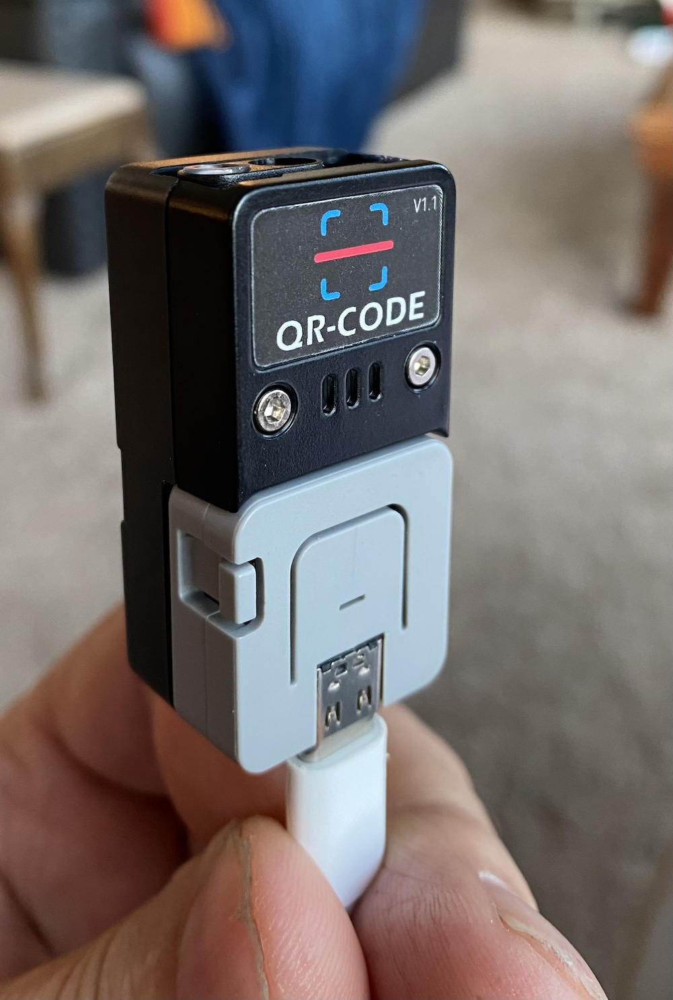

#  M5 QRCODE Scanner Test

This is a test of the M5 QR Scanner.


This is NOT using the continuous scan, and is NOT using the buttons to turn on scanning.

Instead the scanning is in a loop, so others get a chance to run (like Bluetooth and WIFI - when included).

# Building the M5ATOM_Testing executable

After cloning or downloading follow these steps.

1. The arduino runtime must be installed. For example: [ardunio-cli](https://www.arduino.cc).
2. The runtime for the M5stack is required in the <b>Additional Boards Manager URLs</b> of the <b>settings</b>
For example comma seperated json files URL's
```url
https://dl.espressif.com/dl/package_esp32_index.json
https://m5stack.oss-cn-shenzhen.aliyuncs.com/resource/arduino/package_m5stack_index.json
```
3. Set the appropriate Board (under Tools->Board). For the M5 use <b>M5Stick-C-Plus</b> and for the ESP-32 base use <b>ESP32 Dev Module</b>.

4. Modify the [Defines.h](Defines.h) to reflect the build target. For example the M5 devices ESP_M5_ATOM_LITE_QR_SCANNER_CONFIGURATION or ESP_M5_SMART_CLICKER_CONFIGURATION
5. Then build using the arduino compiler and install using the USB cable. Note, that the <b>Partition Scheme</b> should be default including OTA support.
6. Alternately, the Over the Air (OTA), can be used. Currently for this software base these are located at the [http://KnowledgeShark.org](http://KnowledgeShark.org) site. Note that this is <b>http</b> not <b>https</b> as the ESP32 devices cannot currently communicate using the secure connection.
